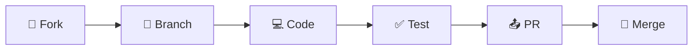

<!-- SPDX-License-Identifier: Apache-2.0 -->

<div align="center">

# 🚀 Android Library

<p align="center">
  
  
  
</p>

<p align="center">
  
  
  
  
</p>

### 💫 Una librería Android modular y reutilizable con funciones utilitarias esenciales

<br>

</div>

## ✨ Características Principales

<table>
<tr>
<td width="25%" align="center">

<br><strong>DeviceUtils</strong>
<br><sub>Información del dispositivo, conectividad y permisos</sub>
</td>
<td width="25%" align="center">

<br><strong>ValidationUtils</strong>
<br><sub>Validaciones comunes (email, teléfono, contraseña)</sub>
</td>
<td width="25%" align="center">

<br><strong>StringUtils</strong>
<br><sub>Manipulación y validación de cadenas</sub>
</td>
<td width="25%" align="center">

<br><strong>DateUtils</strong>
<br><sub>Operaciones con fechas y tiempo</sub>
</td>
</tr>
</table>

## 🚀 Instalación Rápida

<details>
<summary>📦 <strong>Desde GitHub Packages</strong> (Click para expandir)</summary>

### Paso 1: Configurar Autenticación 🔐
Agrega en tu `~/.gradle/gradle.properties`:
```properties
gpr.user=TU_USUARIO_GITHUB
gpr.key=TU_PERSONAL_ACCESS_TOKEN
```

### Paso 2: Configurar Repositorio 📂
En tu `build.gradle.kts` (proyecto):
```kotlin
allprojects {
    repositories {
        google()
        mavenCentral()
        maven {
            name = "GitHubPackages"
            url = uri("https://maven.pkg.github.com/jcano37/android-library")
            credentials {
                username = project.findProperty("gpr.user") as String? ?: System.getenv("USERNAME")
                password = project.findProperty("gpr.key") as String? ?: System.getenv("TOKEN")
            }
        }
    }
}
```

### Paso 3: Agregar Dependencia ⚡
En tu `build.gradle.kts` (módulo):
```kotlin
dependencies {
    implementation("com.android:android-library:1.0.0")
}
```

</details>

> 💡 **Tip**: ¿Primera vez con GitHub Packages? [Guía completa aquí](https://docs.github.com/en/packages/working-with-a-github-packages-registry/working-with-the-gradle-registry)

## 📱 Requisitos del Sistema

<div align="center">

| Componente | Versión | Estado |
|:----------:|:-------:|:------:|
| **Android** | 7.0+ (API 24) |  |
| **Kotlin** | 2.2.20 |  |
| **Java** | 11 |  |
| **Gradle** | 8.13.0 |  |

</div>

## 🛠️ Guía de Uso Interactiva

<details>
<summary>📱 <strong>DeviceUtils</strong> - Información del dispositivo</summary>

```kotlin
import com.android.lib.DeviceUtils

// 📊 Información del dispositivo
val deviceModel = DeviceUtils.getDeviceModel()        // "Samsung Galaxy S21"
val androidVersion = DeviceUtils.getAndroidVersion()  // "12"
val apiLevel = DeviceUtils.getApiLevel()             // 31

// 🌐 Conectividad (requiere permiso ACCESS_NETWORK_STATE)
val isConnected = DeviceUtils.isNetworkAvailable(context)

// 📏 Dimensiones de pantalla
val (width, height) = DeviceUtils.getScreenDimensions(context)

// 🔐 Verificar permisos
val hasCamera = DeviceUtils.isPermissionGranted(context, Manifest.permission.CAMERA)

// 📋 Versión de la app
val appVersion = DeviceUtils.getAppVersion(context)
```

> ⚠️ **Nota**: `getDeviceId()` está deprecado por razones de privacidad

</details>

<details>
<summary>✅ <strong>ValidationUtils</strong> - Validaciones robustas</summary>

```kotlin
import com.android.lib.ValidationUtils

// 📧 Validaciones comunes
val isValidEmail = ValidationUtils.isValidEmail("usuario@ejemplo.com")     // ✅ true
val isValidPhone = ValidationUtils.isValidPhoneNumber("+1234567890")       // ✅ true
val isValidPassword = ValidationUtils.isValidPassword("MiPassword123")     // ✅ true
val isValidUrl = ValidationUtils.isValidUrl("https://ejemplo.com")         // ✅ true

// 💳 Validación de tarjeta (algoritmo Luhn)
val isValidCard = ValidationUtils.isValidCreditCard("4111111111111111")    // ✅ true

// 🔤 Validaciones de texto
val isAlphabetic = ValidationUtils.isAlphabetic("Solo Letras", allowSpaces = true)
val isNumeric = ValidationUtils.isNumeric("12345")
val isInRange = ValidationUtils.isLengthInRange("texto", 3, 10)
```

> 💡 **Tip**: Las validaciones incluyen casos edge y son null-safe

</details>

<details>
<summary>🔤 <strong>StringUtils</strong> - Manipulación de cadenas</summary>

```kotlin
import com.android.lib.StringUtils

// 🔧 Manipulación de cadenas
val isEmpty = StringUtils.isNullOrEmpty(texto)                    // null-safe
val capitalized = StringUtils.capitalizeWords("hola mundo")       // "Hola Mundo"
val noSpaces = StringUtils.removeWhitespace("hola mundo")         // "holamundo"
val truncated = StringUtils.truncate("texto muy largo", 5)        // "texto..."

// 📧 Validación adicional de email
val isValidEmail = StringUtils.isValidEmail("usuario@ejemplo.com") // ✅ true
```

> 🎯 **Casos de uso**: Formateo de UI, limpieza de datos, validaciones rápidas

</details>

<details>
<summary>📅 <strong>DateUtils</strong> - Operaciones con fechas</summary>

```kotlin
import com.android.lib.DateUtils
import java.util.Date

// 📆 Formateo de fechas
val currentDate = DateUtils.getCurrentDate()                      // "2024-01-15"
val currentDateTime = DateUtils.getCurrentDateTime()              // "2024-01-15 14:30:00"
val customFormat = DateUtils.formatDate(Date(), "dd/MM/yyyy")     // "15/01/2024"

// 🔄 Parseo de fechas
val parsedDate = DateUtils.parseDate("2024-01-15")              // Date object

// ⏱️ Operaciones temporales
val daysDiff = DateUtils.daysBetween(startDate, endDate)         // Long
val isToday = DateUtils.isToday(someDate)                       // Boolean
```

> 🌍 **Locale**: Usa `Locale.getDefault()` automáticamente

</details>

## 🔧 Desarrollo y Contribución

<details>
<summary>🚀 <strong>Setup de Desarrollo</strong></summary>

### 1️⃣ Clonar el repositorio
```bash
git clone https://github.com/jcano37/android-library.git
cd android-library
```

### 2️⃣ Compilar el proyecto
```bash
./gradlew build
```

### 3️⃣ Ejecutar tests
```bash
./gradlew test
```

### 4️⃣ Publicar a GitHub Packages
```bash
./gradlew publishReleasePublicationToGitHubPackagesRepository
```

</details>

<details>
<summary>🧪 <strong>Testing y Calidad</strong></summary>

```bash
# Ejecutar todos los tests
./gradlew test

# Generar reporte de cobertura
./gradlew jacocoTestReport

# Análisis estático con Lint
./gradlew lint

# Verificar formato de código
./gradlew ktlintCheck
```

</details>

## 📦 Configuración Avanzada

<details>
<summary>🔑 <strong>GitHub Packages Setup</strong></summary>

### Para Desarrolladores 👨‍💻

1. **Crear Personal Access Token** con permisos:
   - ✅ `read:packages`
   - ✅ `write:packages` (para publicar)

2. **Configurar credenciales**:
```bash
export USERNAME=tu_usuario_github
export TOKEN=tu_personal_access_token
```

### Para CI/CD 🤖

GitHub Actions automático con:
- `GITHUB_TOKEN` ✅
- `GITHUB_ACTOR` ✅

</details>

---

## 🔒 Permisos y Seguridad

<div align="center">

| Permiso | Uso | Requerido |
|:-------:|:---:|:---------:|
| `ACCESS_NETWORK_STATE` | Verificar conectividad |  |

</div>

---

## 🤝 Contribuir al Proyecto

<div align="center">

### ¿Quieres contribuir? ¡Genial! 🎉

</div>



1. **🍴 Fork** el proyecto
2. **🌿 Crea** tu rama (`git checkout -b feature/AmazingFeature`)
3. **💻 Commit** tus cambios (`git commit -m 'Add some AmazingFeature'`)
4. **📤 Push** a la rama (`git push origin feature/AmazingFeature`)
5. **🎊 Abre** un Pull Request

---

## 📞 Soporte y Comunidad

<div align="center">

[](https://github.com/jcano37/android-library/issues)
[](https://github.com/jcano37/android-library/actions)

### 💬 ¿Necesitas ayuda?

| Tipo | Enlace |
|:----:|:------:|
| 🐛 **Bug Reports** | [Crear Issue](https://github.com/jcano37/android-library/issues/new?template=bug_report.md) |
| 💡 **Feature Request** | [Sugerir Feature](https://github.com/jcano37/android-library/issues/new?template=feature_request.md) |
| 📚 **Documentación** | [Wiki](https://github.com/jcano37/android-library/wiki) |

</div>

---

## 📄 Licencia

<!-- SPDX-License-Identifier: Apache-2.0 -->

<div align="center">

[](LICENSE)

**Apache License 2.0** - Libre para uso comercial y personal

Este proyecto está licenciado bajo la Licencia Apache versión 2.0. 
Ver [LICENSE](LICENSE) para más detalles.

</div>

---

<div align="center">

### ⭐ ¡Si te gusta el proyecto, dale una estrella! ⭐

**Hecho con ❤️ para la comunidad Android**

</div>
